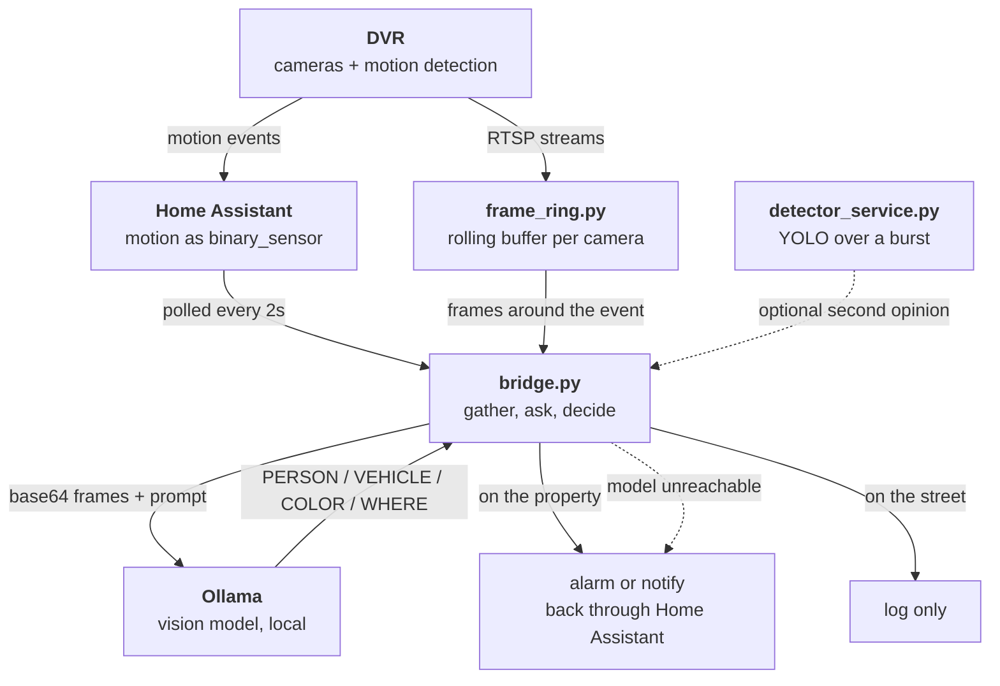

# vlm-security

A local VLM (Vision Language Model) decides whether camera motion should trigger an alarm.

A DVR's motion detection fires on foliage, rain, headlights and cats. An alarm wired straight to it
gets ignored within a week. This puts a locally hosted VLM between the two: motion wakes a short
pipeline, the model is asked what it sees and where, and only a person or vehicle **on the property**
raises the alarm.

Everything runs on your own hardware. No cloud, no vendor account, no camera footage leaving the
house. With power and no internet, it still detects, still records and still triggers.

## Try it in one command

```bash
ollama pull qwen3-vl:4b-instruct
python3 examples/ask.py frame.jpg
```

It prints what the model said, how that parsed, and what the bridge would have decided. No
Home Assistant, no DVR, no cameras, just one image and a local model.

```text
--- model said ---
PERSON: no
VEHICLE: car
COLOR: silver
WHERE: street

--- decision ---
  log only: Silver Car (street)
```

## Design



Home Assistant is the motion source and the notification sink. The bridge polls its
`binary_sensor` states, which is where the entity IDs in `CAMS_JSON` come from, and acts back
through it. Any source of motion events would do, this is what the reference installation uses.

| Piece | Job |
|---|---|
| `frame_ring.py` | Keeps a rolling buffer of recent frames per camera, so the subject's moment is still available when motion is reported late |
| `detector_service.py` | YOLO object detection over a burst of frames, HTTP, decides nothing on its own |
| `bridge.py` | Polls motion sensors, gathers frames, asks the model, decides, triggers |
| `config.py` | Resolves settings from env, then an untracked local file, then generic defaults |

## The two decisions that matter

**Fail open.** If the model is unreachable, the alarm still fires when the panel is armed and a
human was detected. That is the dotted line in the diagram. A vision pipeline that silently stops
triggering is worse than no pipeline, because you believe you are covered. Ambiguity resolves
toward the alarm, and a human disarms.

**Never watch the inside.** Channels overlooking interior space are excluded after all other
configuration, so no combination of settings routes a bedroom into a model or a log.

## Known limitation, documented rather than hidden

Frame selection ranks frames by pixel motion scored on a 64x36 thumbnail. A car in a far corner is
around 10x5 px at that resolution while a wind-blown tree is hundreds, so foliage can outrank the
subject and the model is handed frames the subject is not in. It then answers "empty", correctly,
about the wrong frames. Time-spread sampling or detector-driven selection fixes it.

## Setup

Settings resolve from environment variables, then `~/.home_network.conf`, then defaults. Nothing
about a specific installation belongs in this repository.

```ini
DVR_HOST=dvr.local
HA_URL=http://homeassistant.local
HA_TOKEN=...
OLLAMA_URL=http://127.0.0.1:11434/api/generate
VLM_MODEL=qwen3-vl:4b-instruct
RING_CHANNELS=1,2,3,4
RING_INDOOR_CHANNELS=7,8
CAMS_JSON={"binary_sensor.gate_motion": [4, "Front gate"]}
VLM_SCENE=...
VLM_RULES=...
```

`OLLAMA_URL` points straight at Ollama's `/api/generate`, so the model can run on the same box or
another one.

```bash
python3 scripts/config.py           # print what resolved, never prints a secret
python3 scripts/bridge.py selfcheck # exercise the parser, no hardware needed
```

**`VLM_SCENE` and `VLM_RULES` are the part only you can write.** They tell the model what counts as
your property, and a stranger's copy will produce nonsense at your address.

### Secrets

Environment variables or the local file cover everything. Optionally, on macOS, `config.py` can
pull a secret from [passbox](https://github.com/gabrielkoerich/passbox), which gates each read
behind Touch ID and hands the value to one child process. Opt in with `HN_USE_PASSBOX=1`.

Long-running daemons should never use it: there is no login session under launchd to answer the
prompt, so the call hangs. They read the untracked file instead.

## Status

Extracted from a working installation that has run since 2026. Published as a reference for the
approach, not as a turnkey product. Expect to adapt the prompt, it describes what "on the property"
looks like at a specific house and that is the part only you can write.
